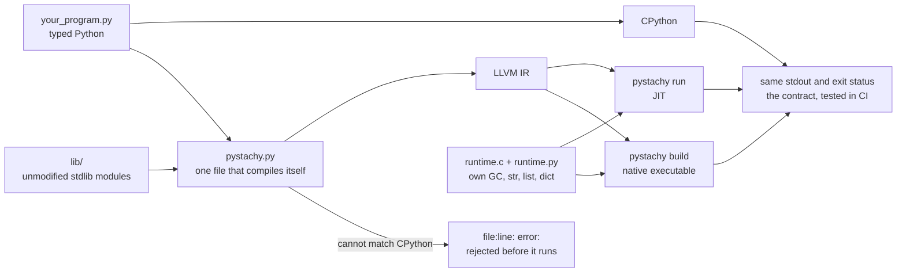

# Pystachy

**Typed Python in, native code out. Same output as CPython, or a compile-time error.**

[](https://github.com/den-run-ai/pystachy/actions/workflows/ci.yml)
[](LICENSE)

Pystachy is a compiler for a statically typed subset of Python. You write ordinary `.py` files
with type hints, and Pystachy compiles them through LLVM: just in time with `pystachy run`, or
ahead of time with `pystachy build`, into a native executable that needs no Python to run. The
compiler is one Python file written in that same subset: CPython can run it, and it compiles
itself.

Its promise is simple. A program that compiles prints exactly what CPython prints, apart from a
list of documented deviations. Where Pystachy cannot keep that promise, it stops with a
`file:line: error:` at compile time instead of quietly doing something different.

**Is it for you?**

- **A good fit:** typed, algorithmic Python (numbers, strings, lists, dicts, dataclasses) that
  you want to run fast or ship as one binary, or curiosity about how a self-hosting compiler
  works.
- **Not yet:** code that needs inheritance (beyond exception classes), lambdas, generators or
  third-party packages. See the [roadmap](#roadmap) and [what is missing](#status-and-limitations).

## At a glance



| | |
|---|---|
| **compiler** | `pystachy.py`, about 16,000 lines, written in the subset it compiles |
| **runtime** | `runtime.c`, under 3,000 lines, with its own garbage collector, and `runtime.py`, its str methods, formatting and hashing written in the subset; needs only the C library |
| **bootstrap** | the compiler running on CPython, the native compiler it builds, and the one that builds itself all emit byte-identical LLVM IR |
| **tests** | about 500 programs that must print what CPython printed for them, JIT and AOT, and over 600 that must be rejected, with the compiler running on CPython and with the native one ([docs/testing.md](docs/testing.md)) |
| **standard library** | 9 unmodified CPython 3.13 modules compile as they are, for the functions the subset supports ([`lib/`](lib/README.md)) |

### Speed

Each benchmark is a plain Python program, run under CPython, under the JIT and as an AOT
executable, and all three must print the same thing. Median of three warm runs on a 4-core
x86-64 VM (CPython 3.13.16, LLVM 18); JIT times include compilation, and the speedups are computed
from the unrounded times.

| benchmark | CPython | Pystachy JIT | Pystachy AOT | AOT speedup |
|---|---:|---:|---:|---:|
| fib(35): calls | 0.80 s | 0.08 s | 0.04 s | 23× |
| mandelbrot: float loops | 1.26 s | 0.09 s | 0.04 s | 34× |
| n-body: floats, objects | 1.82 s | 0.10 s | 0.03 s | 59× |
| spectral norm: nested loops | 1.07 s | 0.14 s | 0.02 s | 67× |
| sieve: 4M-element list | 0.76 s | 0.21 s | 0.15 s | 5× |
| word count: strings, dicts | 0.17 s | 0.10 s | 0.05 s | 3× |
| dict lookups: int and str keys | 0.90 s | 0.47 s | 0.39 s | 2× |
| dict keys that defeat a weak hash | 0.50 s | 0.25 s | 0.16 s | 3× |

Loops over numbers and objects gain the most. String- and dict-heavy code spends its time in the
runtime, as it does under CPython, so it gains less. A hello world takes 60 to 80 ms under the
JIT, compilation included. More in [docs/performance.md](docs/performance.md).

### How it compares

Many projects make Python faster, and each makes different trade-offs. This is a short summary
from their public documentation, as of October 2026; corrections are welcome.

| | what it compiles | output | needs CPython at run time | behaviour vs CPython |
|---|---|---|---|---|
| **Pystachy** | a statically typed subset of Python | native code via LLVM: JIT, or a standalone executable | no | same output, tested against CPython, apart from documented deviations; otherwise a compile-time error |
| CPython | all of Python | bytecode for its interpreter | it is CPython | the reference |
| PyPy | all of Python | machine code from a tracing JIT, at run time | no: it replaces CPython | highly compatible; differs mainly in garbage-collection timing and C extensions |
| Cython | Python, plus optional C type declarations | C extension modules | yes | Python semantics, and C semantics where you declare C types |
| mypyc | type-annotated Python that passes mypy | C extension modules | yes | mostly compatible; annotations are checked at run time |
| Nuitka | all of Python | C, linked against libpython, which it can bundle | yes | aims for full compatibility |
| Codon | a Python dialect for static compilation | native code via LLVM | no; Python interop is optional | not a drop-in replacement: 64-bit `int`, some C numeric semantics by default |
| Shed Skin | an implicitly typed subset of Python | C++, built into an executable or extension module | no, for executables | one static type per variable; 64-bit `int` by default |
| LPython | a typed subset of Python with fixed-width types (`i32`, `f64`) | native code via LLVM, also C, C++ and WebAssembly | no | its programs also run under CPython; alpha |

If you need all of Python, CPython, PyPy and Nuitka run it; for faster modules inside a CPython
application, Cython and mypyc are mature choices. Pystachy sits with Codon, Shed Skin and
LPython: it gives up Python's dynamic features for native programs that run without an
interpreter. Its particular bet is the contract: every test program must reproduce the output
CPython recorded for it, and anything Pystachy cannot match is a compile-time error rather than a
silent difference. It is also the only one of those four whose compiler is written in the language it
compiles and builds itself.

## A taste

This is ordinary Python, and Pystachy and CPython print the same line:

```python
from dataclasses import dataclass


@dataclass
class Item:
    name: str
    price: float
    qty: int = 1


def total(items: list[Item]) -> float:
    return sum([it.price * it.qty for it in items])


cart = [Item("pen", 1.5, 4), Item("book", 12.25)]
stock: dict[str, int] = {}
for it in cart:
    stock[it.name] = stock.get(it.name, 0) + it.qty
print(f"total {total(cart):.2f}", cart, stock, Item("pen", 1.5, 4) in cart)
# total 18.25 [Item(name='pen', price=1.5, qty=4), Item(name='book', price=12.25, qty=1)] {'pen': 4, 'book': 1} True
```

And when a program uses something Pystachy cannot run faithfully yet, you find out before it
runs:

```
$ cat words.py
words = ["pear", "fig", "banana"]
print(sorted(words, key=lambda w: len(w)))
$ ./pystachy run words.py
words.py:2: error: sorted(key=...) is not supported: functions are not values
```

## Quick start

You need LLVM 18 and Python 3.11 or later (3.13 for `make verify`, which checks the runtime's exception
classes against the running CPython's; tested with 3.13). CI
runs on Linux x86-64. On
Ubuntu 24.04, as in CI:

```sh
sudo apt install clang-18 llvm-18 llvm-18-runtime libclang-rt-18-dev   # the last one is for make verify
export PYSTACHY_LLVM=/usr/lib/llvm-18/bin
git clone https://github.com/den-run-ai/pystachy && cd pystachy
make                                    # the compiler builds itself and checks the result
./pystachy run bench/nbody.py           # compile with the JIT and run
./pystachy build bench/nbody.py -o build/nbody && build/nbody   # a native executable
./pystachy ir bench/nbody.py            # print the LLVM IR
./pystachy check bench/nbody.py         # only CPython's syntax checks, nothing compiled
make test                               # the differential tests against CPython
make verify                             # everything CI runs; report in build/verification.json
```

Your first five minutes: save the example from [A taste](#a-taste) as `cart.py`, then compare `python3 cart.py`
with `./pystachy run cart.py`. Before `make`, `python3 pystachy.py run cart.py` runs the
compiler on CPython. Other settings are listed in
[docs/internals.md](docs/internals.md#environment-variables).

## What makes it different

- **Same output, or a compile-time error.** The compiler reproduces CPython's behaviour or
  refuses the program with `file:line: error:`. Even CPython's syntax errors are reported at
  CPython's line, almost always with CPython's message.
- **CPython is the oracle.** Every test program's stdout and exit status are recorded from
  CPython, and Pystachy must reproduce them, JIT and AOT.
- **It compiles itself, to a fixed point.** The compiler built by CPython and the compiler built
  by itself must emit identical LLVM IR, so any place where Pystachy and CPython disagree inside
  the compiler shows up as a diff. CI also rebuilds it with no Python on `PATH`.
- **Unmodified library code compiles.** An unannotated module-level function is a template,
  compiled for the argument types of each call, and what CPython decides at import time (`__main__` guards,
  platform tests, optional C accelerators) is decided at compile time. That is how `bisect`,
  `heapq`, `posixpath` and six more CPython modules compile as they are.
- **A small runtime that copies CPython where it shows.** `runtime.c` has its own garbage
  collector and needs only the C library. Lists sort with a port of CPython's timsort, and dicts
  use CPython 3.13's layout, so ordering and iteration match.
- **Two tiers.** `pystachy run` compiles with LLVM's JIT for a fast start; `pystachy build`
  optimizes the program and the runtime together into one executable.
- **Fast to compile, and kept that way.** The native compiler turns its own source into LLVM IR
  in 0.5 s of CPU time, and CI fails if compile time stops growing linearly with the program.

## Roadmap

The goal is to compile more existing Python: CPython's standard library, then popular PyPI
packages. [Issue #5](https://github.com/den-run-ai/pystachy/issues/5) adds dynamic features back
in the order of how much real code each lets compile. The numbers are cumulative estimates from
a static model: an upper bound on the share of functions whose constructs would all be
supported, not a measurement of what runs today.

| milestone | what it adds | top-1000 PyPI functions | CPython `Lib/` functions | stdlib modules that import (of the model's 529) |
|---|---|---:|---:|---:|
| today | the subset described in [docs/language.md](docs/language.md) | 1.8% | 4.5% | 38 |
| [M1](https://github.com/den-run-ai/pystachy/issues/6) | lenient annotations, cheap refinements | 4.8% | 4.6% | 38 |
| [M2](https://github.com/den-run-ai/pystachy/issues/7) | full classes: inheritance, unannotated methods, properties | 18.8% | 25.6% | 39 |
| [M3](https://github.com/den-run-ai/pystachy/issues/8) | functions as values: callbacks, lambdas, closures, decorators | 44.9% | 41.5% | 39 |
| [M4](https://github.com/den-run-ai/pystachy/issues/9) | dynamic values: `Optional` scalars, unions, `Any` | 51.3% | 47.8% | 41 |
| [M5](https://github.com/den-run-ai/pystachy/issues/10) | exceptions | 55.7% | 53.5% | 41 |
| [M6](https://github.com/den-run-ai/pystachy/issues/11) | native stdlib hubs, C-module shims | 58.7% | 56.8% | 124 |
| [M7](https://github.com/den-run-ai/pystachy/issues/12) | the long tail: generators, `async`, sets, `bytes`, `str.format` | 90.4% | 99.0% | 523 |

Parts of M4 and M5 landed in #22. Open findings from earlier differential testing are
tracked in [#13](https://github.com/den-run-ai/pystachy/issues/13) to
[#17](https://github.com/den-run-ai/pystachy/issues/17).

**New in [#22](https://github.com/den-run-ai/pystachy/pull/22): a typed IR** (its
[design](docs/typed-ir.md) was merged in [#21](https://github.com/den-run-ai/pystachy/pull/21)):
a small typed layer between type checking and LLVM, built step by step so that every step
leaves every program's LLVM IR byte-identical (`make irsame` checks it). On top of it: exceptions
(`try`/`except`/`else`/`finally`, `raise`, exception classes of the program) by table-driven
unwinding, `T | None` for `str`, `list`, `dict` and `tuple`, boxed `int | None`,
`float | None` and `bool | None`, `NamedTuple`, tuple dict keys, `@classmethod`,
`@staticmethod`, `__getitem__` and friends, and the first IR optimizations (fused dict lookups
make a dict-counting benchmark 31% faster AOT). With them, iniconfig, pytest's INI parser,
compiles after a few small edits ([`ports/iniconfig`](ports/iniconfig/PORT.md)).

**New in [#19](https://github.com/den-run-ai/pystachy/pull/19): part of the runtime in Python.**
52 runtime functions, among them all the `str` methods and the format-spec mini-language, are
written in the subset and compiled by Pystachy itself. Programs call them as before, at the same
speed on the benchmarks.
Follow-ups are tracked in [#31](https://github.com/den-run-ai/pystachy/issues/31).

**An open question:** should Pystachy stay standalone, or also gain an ahead-of-time
CPython-extension mode, like mypyc, so that compiled code can use real PyPI packages?
[#4](https://github.com/den-run-ai/pystachy/issues/4) weighs the options; input is welcome.

**Further out:** single inheritance with vtables; `set` and `frozenset` on top of the dict table;
more of the standard library, ranked by payoff in [docs/stdlib.md](docs/stdlib.md); and a
WebAssembly GC backend, which a runtime written in the subset makes easier.

## Status and limitations

Pystachy is young and deliberately strict. These features are left out for now, because each
needs a dynamic runtime or a large compiler feature. The parser accepts them all, and the
compiler rejects each where it would have to compile it.

| not supported yet | on the roadmap |
|---|---|
| exception attributes such as `e.args`, `except*` (`try`, `raise` and exception classes came in [#22](https://github.com/den-run-ai/pystachy/pull/22)) | M5 |
| unions other than `Optional` (which [#22](https://github.com/den-run-ai/pystachy/pull/22) brought to `int`, `str` and the other builtin types) | M4 |
| inheritance, but for exception classes | M2 |
| lambdas, closures, functions as values (`map`, `key=`) | M3 |
| generators, `async`, sets, `bytes` | M7 |
| dict and multi-clause comprehensions, slice steps, `getattr`/`eval`, complex numbers, `match`, `:=` | [#5](https://github.com/den-run-ai/pystachy/issues/5) |

Programs that compile can still differ from CPython in a few documented ways: `int` is 64-bit
and raises `OverflowError` where CPython would grow it (it never wraps); `str` holds UTF-8 bytes,
so `len` counts bytes (ASCII behaves exactly like CPython); an exception that nothing catches
prints only the last line of the traceback; recursion that is too deep crashes the program
instead of raising `RecursionError`; and `__del__` never runs. The complete lists are in
[docs/language.md](docs/language.md), under
[deviations](docs/language.md#deviations-from-cpython) and
[rejected programs](docs/language.md#rejected-rather-than-miscompiled).

Of the standard library, 38 of 519 modules import today, and no popular PyPI package imports as
a whole yet, though algorithmic code copied out of packages often runs unmodified or after a few
edits ([docs/stdlib.md](docs/stdlib.md)).

## Design decisions

A few choices shape everything else. Each is explained, with the pull request that made it, in
[docs/history.md](docs/history.md).

| decision | why |
|---|---|
| build on Ouro v1 | of four self-hosting Python-subset compilers compared before this repository started, it had the broadest subset, matched CPython most closely and ran fastest |
| reject rather than miscompile | a clear error at compile time is better than a program that silently behaves differently |
| CPython's output is the specification | programs are ordinary Python, so CPython decides what is correct, and tests compare against it |
| 64-bit checked `int` | fast native arithmetic; overflow raises instead of wrapping |
| a garbage collector of its own, in C | no dependencies, and memory stays near the live set |
| templates for unannotated functions | most of the standard library is unannotated, so it compiles per call types instead |
| import-time decisions at compile time | unmodified library modules, with their platform tests and optional accelerators, compile |
| a typed IR, introduced byte for byte | room for optimizations and new backends, with every step checked to change no program's output |

## Documentation

| document | what is in it |
|---|---|
| [docs/language.md](docs/language.md) | the language reference: types, typing rules, modules, what is removed, deviations, what is rejected |
| [docs/internals.md](docs/internals.md) | how the compiler and the runtime work, repository layout, environment variables |
| [docs/testing.md](docs/testing.md) | the test suite, `make verify`, the IR oracle for refactors, CI |
| [docs/performance.md](docs/performance.md) | benchmarks, start-up, memory and compile time |
| [docs/stdlib.md](docs/stdlib.md) | how much of the standard library and of PyPI compiles, and what it would take to compile more |
| [docs/typed-ir.md](docs/typed-ir.md) | the typed IR: its design, and how far #22 built it |
| [docs/runtime-in-subset.md](docs/runtime-in-subset.md) | writing the runtime in the subset itself: the prototype (`runtime.py`), its measurements, and how other compilers do it |
| [docs/history.md](docs/history.md) | the timeline, the design decisions and the Ouro v1 lineage |
| [lib/README.md](lib/README.md) | the unmodified standard-library modules that ship with Pystachy |

## Get involved

Pystachy is young, and most of its work is easy to check: a change is right when the output
matches CPython's. Good places to start:

- **M1 items** ([#6](https://github.com/den-run-ai/pystachy/issues/6)): small builtins and
  methods (`hex`, `oct`, `bin`, `dict.update`, `math.modf`, ...), a `lib/warnings.py` with
  `warn()`, folding `sys.version_info` tests at compile time.
- **The standard library:** [docs/stdlib.md](docs/stdlib.md) lists 17 modules that compile after
  1 to 18 small edits each; each feature that removes an edit moves one of them closer to `lib/`.
- **Bugs:** the [open issues](https://github.com/den-run-ai/pystachy/issues), and any program
  whose output differs from CPython's.

How a test works: put a program in `tests/NAME.py`, record CPython's output with
`tests/record.sh NAME`, and `make test` checks it under the JIT and AOT. A program that must be
rejected goes in `tests/errors/`, with the expected message in a comment on its first line.
Before a pull request, run `make verify`, which runs what CI runs; after a code-generator
refactor, `make irsame REF=main` shows that no program's IR changed. Work on the typed IR or
`runtime.py` touches the code generator and the runtime, so open an issue (for `runtime.py`,
comment on [#31](https://github.com/den-run-ai/pystachy/issues/31)) before starting something large there.

## License

MIT ([LICENSE](LICENSE)). The list sort in `runtime.c` is a port of CPython's, and the vendored
CPython modules in `lib/` are CPython's own; both are used under the PSF License Version 2
([THIRD_PARTY_NOTICES](THIRD_PARTY_NOTICES)).
