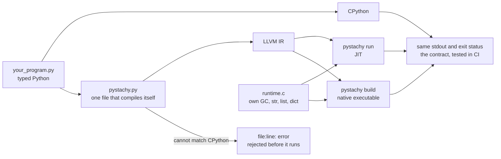

# Pystachy

**Typed Python in, native code out. Same output as CPython, or a compile-time error.**

[](https://github.com/den-run-ai/pystachy/actions/workflows/ci.yml)
[](LICENSE)

Pystachy is a compiler for a statically typed subset of Python. You write ordinary `.py` files
with type hints, and Pystachy compiles them through LLVM: just in time with `pystachy run`, or
ahead of time with `pystachy build`, into a native executable that needs no Python to run. The
compiler is one Python file written in that same subset: CPython can run it, and it compiles
itself.

Its promise is simple. A program that compiles prints exactly what CPython prints, apart from a
short list of documented deviations. Where Pystachy cannot keep that promise, it stops with a
`file:line: error:` at compile time instead of quietly doing something different.

**Is it for you?**

- **A good fit:** typed, algorithmic Python (numbers, strings, lists, dicts, dataclasses) that
  you want to run fast or ship as one binary, or curiosity about how a self-hosting compiler
  works.
- **Not yet:** code that needs exceptions, inheritance, lambdas, generators or third-party
  packages. See [what is missing](#status-and-limitations) and the [roadmap](#roadmap).

## At a glance



| | |
|---|---|
| **compiler** | `pystachy.py`, 11,118 lines, written in the subset it compiles |
| **runtime** | `runtime.c`, 2,675 lines, with its own garbage collector; needs only the C library |
| **bootstrap** | the compiler built by CPython and the compiler built by itself emit the same 140,206 lines of LLVM IR |
| **tests** | 295 programs, 421 rejection cases, 11 deviation cases, 6 IR probes: 1,175 checks pass, JIT and AOT |
| **standard library** | 9 unmodified CPython 3.13 modules compile as they are ([`lib/`](lib/README.md)) |

### Speed

Median of three warm runs on a 4-core x86-64 VM (CPython 3.13.16, LLVM 18). JIT times include
compilation, and every output is checked against CPython's.

| benchmark | CPython | Pystachy JIT | Pystachy AOT | AOT speedup |
|---|---:|---:|---:|---:|
| fib(35): calls | 0.80 s | 0.08 s | 0.04 s | 23× |
| mandelbrot: float loops | 1.26 s | 0.09 s | 0.04 s | 34× |
| n-body: floats, objects | 1.82 s | 0.10 s | 0.03 s | 59× |
| spectral norm: nested loops | 1.07 s | 0.14 s | 0.02 s | 67× |
| sieve: 4M-element list | 0.76 s | 0.21 s | 0.15 s | 5× |
| word count: strings, dicts | 0.17 s | 0.10 s | 0.05 s | 3× |
| dict lookups: int and str keys | 0.90 s | 0.47 s | 0.39 s | 2× |
| dict keys that defeat a weak hash | 0.50 s | 0.25 s | 0.16 s | 3× |

Loops over numbers and objects gain the most. String- and dict-heavy code spends its time in the
runtime, as it does under CPython, so it gains less. A hello world takes 60 to 80 ms under the
JIT, compilation included. More in [docs/performance.md](docs/performance.md).

### How it compares

Many projects make Python faster, and each makes different trade-offs. This is a short summary
from their public documentation, as of October 2026; corrections are welcome.

| | what it compiles | output | needs CPython at run time | behaviour vs CPython |
|---|---|---|---|---|
| **Pystachy** | a statically typed subset of Python; unannotated functions are compiled per call types | native code via LLVM: JIT, or a standalone executable | no | same stdout and exit status, tested against CPython on every push; what it cannot match is a compile-time error |
| CPython | all of Python | bytecode for its interpreter | it is CPython | the reference |
| PyPy | all of Python | machine code from a tracing JIT, at run time | no: it replaces CPython | highly compatible; differs mainly in garbage-collection timing and C extensions |
| Cython | Python, plus optional C type declarations | C extension modules | yes | Python semantics, and C semantics where you declare C types |
| mypyc | type-annotated Python that passes mypy | C extension modules | yes | mostly compatible; annotations are checked at run time |
| Nuitka | all of Python | C, linked against libpython, which it can bundle | yes | aims for full compatibility |
| Codon | a Python dialect for static compilation | native code via LLVM | no; Python interop is optional | not a drop-in replacement: 64-bit `int`, some C numeric semantics by default |
| Shed Skin | an implicitly typed subset of Python | C++, built into an executable or extension module | no, for executables | one static type per variable; 64-bit `int` by default |
| LPython | a typed subset of Python with fixed-width types (`i32`, `f64`) | native code via LLVM, also C, C++ and WebAssembly | no | its programs also run under CPython; alpha |

Pystachy is closest to Codon, Shed Skin and LPython: a static subset compiled to standalone
native code. Its particular bet is the contract: every test program runs under both CPython and
Pystachy, and anything Pystachy cannot match is a compile-time error rather than a silent
difference. It is also the only one of those four whose compiler is written in the language it
compiles and builds itself.

## A taste

This is ordinary Python, and Pystachy and CPython print the same line:

```python
from dataclasses import dataclass


@dataclass
class Item:
    name: str
    price: float
    qty: int = 1


def total(items: list[Item]) -> float:
    return sum([it.price * it.qty for it in items])


cart = [Item("pen", 1.5, 4), Item("book", 12.25)]
stock: dict[str, int] = {}
for it in cart:
    stock[it.name] = stock.get(it.name, 0) + it.qty
print(f"total {total(cart):.2f}", cart, stock, Item("pen", 1.5, 4) in cart)
# total 18.25 [Item(name='pen', price=1.5, qty=4), Item(name='book', price=12.25, qty=1)] {'pen': 4, 'book': 1} True
```

And when a program uses something Pystachy cannot run faithfully yet, you find out before it
runs:

```
$ cat words.py
words = ["pear", "fig", "banana"]
print(sorted(words, key=lambda w: len(w)))
$ ./pystachy run words.py
words.py:2: error: sorted(key=...) is not supported: functions are not values
```

## Quick start

You need LLVM/clang 18 (`clang`, `llvm-link`, `opt`, `lli`, `llvm-as`; on Ubuntu 24.04 the
packages `clang-18 llvm-18 llvm-18-runtime`, plus `libclang-rt-18-dev` for `make verify`) and
CPython 3.11 or later (tested with 3.13) for the bootstrap. CI tests Linux x86-64. If the LLVM
tools are not on `PATH` under those names, set `PYSTACHY_LLVM=/usr/lib/llvm-18/bin`.

```sh
git clone https://github.com/den-run-ai/pystachy && cd pystachy
make                                    # the compiler builds itself and checks the result
./pystachy run bench/nbody.py           # compile with the JIT and run
./pystachy build bench/nbody.py -o build/nbody && build/nbody   # a native executable
./pystachy ir prog.py                   # print the LLVM IR
./pystachy check prog.py                # only CPython's syntax checks, nothing compiled
make test                               # the differential tests against CPython
make verify                             # everything CI runs; report in build/verification.json
```

Your first five minutes: save the example above as `cart.py`, then compare `python3 cart.py`
with `./pystachy run cart.py`. Before `make`, `python3 pystachy.py run cart.py` runs the
compiler on CPython. Other settings are listed in
[docs/internals.md](docs/internals.md#environment-variables).

## What makes it different

- **Same output, or a compile-time error.** The compiler either reproduces CPython's behaviour
  or refuses the program with `file:line: error:`; 421 test cases pin those refusals down. Every
  `SyntaxError` that CPython reports before running a file is reported with CPython's message
  and line.
- **CPython is the oracle.** Every test program runs under CPython and under Pystachy, JIT and
  AOT, and stdout and exit status must match, with both the CPython-hosted and the self-compiled
  compiler.
- **It compiles itself, to a fixed point.** `make` has CPython build stage 1 and stage 1 build
  stage 2, and all three must emit identical LLVM IR, so any place where Pystachy and CPython
  disagree inside the compiler shows up as a diff. In CI, with no Python on `PATH`, the native
  compiler rebuilds itself and passes the tests.
- **Unmodified library code compiles.** A module-level function without annotations is a
  template, compiled once for each list of argument types it is called with, and what CPython
  decides at import time (`__main__` guards, `TYPE_CHECKING`, platform tests, optional C
  accelerators) is decided at compile time. Together they let `bisect`, `heapq`, `posixpath`
  and six more CPython modules compile as they are.
- **A small runtime that copies CPython where it shows.** `runtime.c` has its own conservative
  garbage collector and needs nothing beyond the C library. Where output depends on an
  algorithm, it uses CPython's: lists sort with a port of CPython's timsort, which makes the same
  comparisons in the same order, and dicts use CPython 3.13's compact layout.
- **Two tiers.** `pystachy run` compiles with LLVM's ORC JIT for a fast start; `pystachy build`
  links the program and the runtime into one module and optimizes them together.
- **Fast to compile, and kept that way.** The native compiler turns its own 11,000 lines into
  LLVM IR in 0.2 s of CPU time (1.4 s on CPython), and CI fails if compile time stops growing
  linearly with the program.

## Roadmap

The goal is to compile more existing Python: CPython's standard library, then popular PyPI
packages. [Issue #5](https://github.com/den-run-ai/pystachy/issues/5) plans the way there in
milestones, each sized with a static model: the share of functions in the top 1,000 PyPI
packages and in CPython's `Lib/` that would need no missing feature, and the standard-library
modules that would import. The percentages are upper bounds.

| milestone | what it adds | top-1000 PyPI functions | CPython `Lib/` functions | stdlib modules that import |
|---|---|---:|---:|---:|
| today | | 1.8% | 4.5% | 38 |
| [M1](https://github.com/den-run-ai/pystachy/issues/6) | lenient annotations, cheap refinements | 4.8% | 4.6% | 38 |
| [M2](https://github.com/den-run-ai/pystachy/issues/7) | full classes: inheritance, unannotated methods, properties | 18.8% | 25.6% | 39 |
| [M3](https://github.com/den-run-ai/pystachy/issues/8) | functions as values: callbacks, lambdas, closures, decorators | 44.9% | 41.5% | 39 |
| [M4](https://github.com/den-run-ai/pystachy/issues/9) | dynamic values: `Optional` scalars, unions, `Any` | 51.3% | 47.8% | 41 |
| [M5](https://github.com/den-run-ai/pystachy/issues/10) | exceptions | 55.7% | 53.5% | 41 |
| [M6](https://github.com/den-run-ai/pystachy/issues/11) | native stdlib hubs, C-module shims | 58.7% | 56.8% | 124 |
| [M7](https://github.com/den-run-ai/pystachy/issues/12) | the long tail: generators, `async`, sets, `bytes`, `str.format` | 90.4% | 99.0% | 523 |

**In progress now** (draft pull requests, not merged yet):

- **A typed IR** ([#22](https://github.com/den-run-ai/pystachy/pull/22); its
  [design](docs/typed-ir.md) was merged in [#21](https://github.com/den-run-ai/pystachy/pull/21)):
  a small typed layer between type checking and LLVM, built step by step so that every step
  emits byte-identical output (`make irsame` checks it). On top of it: `Optional` of `str`,
  `list`, `dict`, `tuple` and the scalars, `NamedTuple`, tuple dict keys, `@classmethod`,
  `@staticmethod`, `__getitem__` and friends, and the first IR optimizations (fused dict lookups
  make a dict-counting benchmark 31% faster AOT). Exceptions (`try`/`except`/`finally`, user
  exception classes) are being merged into it.
- **Part of the runtime in Python** ([#19](https://github.com/den-run-ai/pystachy/pull/19)): 52
  runtime functions, among them all the `str` methods and the format-spec mini-language, are
  written in the subset and compiled by Pystachy itself, with no change to any program's IR and
  the same performance.

**An open question:** should Pystachy stay standalone, or also gain an ahead-of-time
CPython-extension mode, like mypyc, so that compiled code can use real PyPI packages?
[#4](https://github.com/den-run-ai/pystachy/issues/4) weighs the options; input is welcome.

**Further out:** a WebAssembly GC backend, where the engine supplies memory management and
tiered compilation; single inheritance with vtables; `set` and `frozenset` on top of the dict
table; and more of the standard library, ranked by payoff in [docs/stdlib.md](docs/stdlib.md).

## Status and limitations

Pystachy is young and deliberately strict. These features are left out for now, because each
needs a dynamic runtime or a large compiler feature. The parser accepts them all, and the
compiler rejects each where it would have to compile it.

| not supported yet | on the roadmap |
|---|---|
| exceptions: `try`/`except`, user exception classes (`with` works for files) | M5, in progress in [#22](https://github.com/den-run-ai/pystachy/pull/22) |
| `Optional` of `int` or `str`, unions | M4, partly in progress in [#22](https://github.com/den-run-ai/pystachy/pull/22) |
| inheritance | M2 |
| lambdas, closures, functions as values (`map`, `key=`) | M3 |
| generators, `async`, sets, `bytes` | M7 |
| dict and multi-clause comprehensions, slice steps, `getattr`/`eval`, complex numbers, arbitrary-precision `int`, `match`, `:=` | [#5](https://github.com/den-run-ai/pystachy/issues/5) |

Programs that compile can still differ from CPython in a few documented ways: `int` is 64-bit
and raises `OverflowError` where CPython would grow it (it never wraps); `str` holds UTF-8 bytes,
so `len` counts bytes (ASCII behaves exactly like CPython); a runtime error prints only the last
line of the traceback; recursion is limited by the native stack; and there are no finalizers.
The complete lists are in [docs/language.md](docs/language.md), under
[deviations](docs/language.md#deviations-from-cpython) and
[rejected programs](docs/language.md#rejected-rather-than-miscompiled).

Of the standard library, 38 of 519 modules import today, and no popular PyPI package imports as
a whole yet, though algorithmic code copied out of packages often runs unmodified or after a few
edits ([docs/stdlib.md](docs/stdlib.md)).

## Design decisions

A few choices shape everything else. Each is explained, with the pull request that made it, in
[docs/history.md](docs/history.md).

| decision | why |
|---|---|
| build on Ouro v1 | of four self-hosting Python-subset compilers compared before this repository started, it had the broadest subset, matched CPython most closely and ran fastest |
| reject rather than miscompile | a clear error at compile time is better than a program that silently behaves differently |
| CPython's output is the specification | programs are ordinary Python, so CPython decides what is correct, and tests compare against it |
| 64-bit checked `int` | fast native arithmetic; overflow raises instead of wrapping |
| a conservative garbage collector in C | no dependencies, and memory stays near the live set |
| templates for unannotated functions | most of the standard library is unannotated, so it compiles per call types instead |
| import-time decisions at compile time | lets unmodified library modules, with their platform tests and optional accelerators, compile |
| a typed IR, introduced byte for byte (in progress) | room for optimizations and new backends, with every step checked to change no program's output |

## Documentation

| document | what is in it |
|---|---|
| [docs/language.md](docs/language.md) | the language reference: types, typing rules, modules, what is removed, deviations, what is rejected |
| [docs/internals.md](docs/internals.md) | how the compiler and the runtime work, repository layout, environment variables |
| [docs/testing.md](docs/testing.md) | the test suite, `make verify`, the IR oracle for refactors, CI |
| [docs/performance.md](docs/performance.md) | benchmarks, start-up, memory and compile time |
| [docs/stdlib.md](docs/stdlib.md) | how much of the standard library and of PyPI compiles, and what it would take to compile more |
| [docs/typed-ir.md](docs/typed-ir.md) | the typed IR design (in progress) |
| [docs/history.md](docs/history.md) | the timeline, the design decisions and the Ouro v1 lineage |
| [lib/README.md](lib/README.md) | the unmodified standard-library modules that ship with Pystachy |

## Get involved

Pystachy is young, and most of its work is easy to check: a change is right when the output
matches CPython's. Good places to start:

- **M1 items** ([#6](https://github.com/den-run-ai/pystachy/issues/6)): small builtins and
  methods (`hex`, `oct`, `bin`, `dict.update`, `math.modf`, ...), a `lib/warnings.py` with
  `warn()`, folding `sys.version_info` tests at compile time.
- **The standard library:** [docs/stdlib.md](docs/stdlib.md) lists 17 modules that compile after
  a few small edits; each feature that removes an edit moves one of them closer to `lib/`.
- **Bugs:** the [open issues](https://github.com/den-run-ai/pystachy/issues), and any program
  whose output differs from CPython's.

How a test works: put a program in `tests/NAME.py`, record CPython's output with
`tests/record.sh NAME`, and `make test` checks it under the JIT and AOT. A program that must be
rejected goes in `tests/errors/`, with the expected message in a comment on its first line.
Before a pull request, run `make verify`, which runs what CI runs; after a code-generator
refactor, `make irsame REF=main` shows that no program's IR changed. The typed IR and runtime.py
work touches the code generator and the runtime, so comment on its issue or pull request before
starting something large there.

## License

MIT ([LICENSE](LICENSE)). The list sort in `runtime.c` is a port of CPython's, and the modules in
`lib/` are CPython's own; both are used under the PSF License Version 2
([THIRD_PARTY_NOTICES](THIRD_PARTY_NOTICES)).
