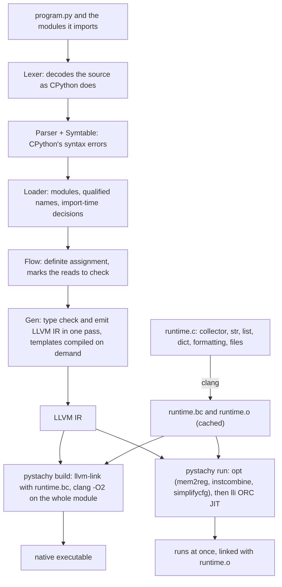

# How Pystachy works

This page walks through the compiler (`pystachy.py`) and its runtime (`runtime.c`): how a
program becomes LLVM IR, how the runtime reproduces CPython's behaviour, and how the compiler
builds itself. For what the language accepts, see [language.md](language.md); for how all of
this is tested, see [testing.md](testing.md).



## Repository layout

| file | lines | contents |
|---|---:|---|
| `pystachy.py` | 11,118 | lexer 611 · parser 1,690 · scopes (CPython's symbol-table errors) 685 · module loader 1,886 · types, tables and the definite-assignment pass 963 · type checker + IR generator 5,096 · driver 132 |
| `runtime.c` | 2,675 | garbage collector, strings, lists and timsort, dicts, generic repr/compare, formatting, files and I/O, clocks |
| `lib/` | 9 modules | unmodified CPython 3.13 standard library modules that compile as they are ([`lib/README.md`](../lib/README.md)) |
| `tests/` | 295 programs, 421 rejection cases, 11 deviation cases, 6 IR probes | each program must print exactly what CPython prints, JIT and AOT ([testing.md](testing.md)) |
| `bench/` | 8 programs | the benchmarks of [performance.md](performance.md) |
| `tools/` | | the IR oracle, the syntax and import sweeps, the scaling check, the dict probe counter and the stdlib census |

## Environment variables

| variable | effect |
|---|---|
| `PYSTACHY_LLVM` | directory of the LLVM 18 tools (`clang`, `llvm-link`, `opt`, `lli`, `llvm-as`) when they are not on `PATH` under those names, e.g. `/usr/lib/llvm-18/bin` |
| `PYSTACHY_HOME` | the checkout that holds `runtime.c`, `lib/` and the `build/` cache, for a compiler installed elsewhere (by default the compiler looks next to itself, or in its parent directory) |
| `PYSTACHY_PATH` | extra directories, separated by `:`, to search for imported modules |
| `PYSTACHY_CFLAGS` | extra clang flags (such as sanitizers) for the runtime and the AOT build, with a runtime cache per flag set |
| `PYSTACHY_GC_STRESS=N` | collect garbage every N allocations |
| `PYSTACHY_GC` | `off` turns collection off, `stats` prints a summary at exit |
| `PYSTACHY_JOBS` | how many test cases `tests/run.sh` and the IR tools run at once (default: one per CPU) |

## Design, piece by piece

The parts below follow a program through the compiler (`Lexer`, `Symtable`, the `Loader`, `Flow`
and `Gen` in `pystachy.py`), then through the runtime and the driver.

```

### Modules by renaming

The loader parses each imported module once, decides what CPython
would decide at import time ([language reference](language.md#decided-at-compile-time-as-cpython-decides-it-at-import-time)), and qualifies every module-level name with its
module's (`heapq$heappush`: `$` cannot occur in an identifier); references through a
module (`heapq.heappush`, or `heappush` after `from heapq import heappush`) become that
name. Before that, once every module is loaded, the loader walks each module's statements
once, in order, with the names surely bound and those bound on some path so far
(`Loader.deftime`): it checks there what each `def` and `class` statement evaluates
(annotations and bases everywhere; decorators, default values and class bodies in imported
modules), reporting what CPython would raise then. Code generation then sees one program
without module objects. A module's top-level code is the function `@init.<module>`, which
runs its body the first time an import calls it. Line numbers carry their file
(`k * 10,000,000 + line` for the k-th file), so errors anywhere name the right file. A
module whose code surely raises `ImportError` at its top level gets a guard flag: an
optional import sets it, and the raise then returns from `@init.<module>`, marked as not
run, so that the handler runs.

### Syntax first

`Lexer.file()` decodes each source file as CPython does (a coding
declaration; an imported module as bytes). As each module is parsed, `Symtable` walks its
scopes the way CPython's symbol table and compiler do, so a file CPython would refuse to
start is rejected even where Pystachy compiles nothing. A lexer error is a token that the
parser reports when it reaches it, as CPython's tokenizer runs only as far as its parser
reads. The parser counts its own recursion and the depth of the chains it builds, so
neither compiler runs out of stack (`MAXNEST`; the CPython-hosted compiler raises its
recursion limit to match), and the levels CPython's parser would use for the same code, to
reject what would overflow CPython's parser stack (`CPYSTACK`).

### One pass from AST to IR

After a declaration pass collects classes, fields and
function signatures, `Gen` walks each function once, inferring expression types
bottom-up while emitting IR. An expected type (`want`) flows top-down to type empty
literals and `None`. Types are canonical strings (`dict[str,list[int]]`), so the
compiler needs no type objects.

### Templates

A call to a template evaluates its arguments, then looks up the function
compiled for their types, compiling it on the spot if there is none yet: `Gen` saves its
state for the function it is in, compiles the template's body for the argument types (its
first `return` with a value fixes the return type, so a recursive call after it works), and
resumes. A `None` argument is not passed at all: in that instance the parameter is a
constant `None`. Errors in an instance name the call that compiled it. A function compiled
in the middle of module code (a template's, or one compiled early because a read needs the
type of a global it assigns or fills) may read globals that this code assigns later: their
first binding in the branches that run gives them their type, compiled in the module's
frame into code that is dropped. A call compiled before the `def` or `class` statement of
the function it calls loads that function's non-constant default values from the global
the statement fills when it runs, so they are still evaluated once.

### Definite assignment

Before code generation, `Flow` walks every scope with the set
of variables assigned on every path (merging `if` branches, and a loop's `else` block with
the state before the loop, leaving `while True` only through what its breaks have in
common). Reads it cannot prove are marked, and only those test an "is
assigned" flag that LLVM removes again where it can; fields that `__init__` may leave
unassigned get a hidden flag in the object. Globals read in functions are safe when
module code assigned them before its first call into user code, and calls to a
function before its `def` has run raise `NameError`. The compiler itself needs none of
these checks. The pass costs what the code contains: a function is analysed over the names
its body mentions, not over every global of its module; a branch is undone from a log of
the changes it made rather than by copying the set, and an `if` leaves in that log only the
names whose state it changed, so the `if`s around it (an `elif` chain) do not look at the
rest again. Whether an import may run the importing module again (a circular import) is
read from the strongly connected components of the import graph. The same pass
marks what an imported module's `def` and `class` statements read in code that Pystachy
leaves uncompiled, and those reads are checked where the statement runs.

### Checked arithmetic, cheap errors

`+`, `-` and `*` use LLVM's `*.with.overflow`
intrinsics; every failure (overflow, `None` receiver, unassigned variable) branches to
one cold block per function and message. `self` is marked `nonnull`, so the `None`
checks vanish inside methods.

### SSA by delegation

Locals live in `alloca` slots; LLVM's `mem2reg` turns them into
SSA registers. Short-circuit operators, conditional expressions and comparison chains
use `phi` nodes directly.

### One value model

Scalars map to `i64`, `double` and `i1`; strings, containers,
tuples and objects are pointers. Container elements are uniform 8-byte slots, so one C
implementation of `list`/`dict`/`tuple` serves every element type.

### Type descriptors

Generic operations (`repr`, `==`, ordering, `sort`, `in`) receive a
tiny string describing the static type — `LDsi` is `list[dict[str,int]]` — and the
runtime interprets it recursively, comparing sequences the way CPython does (first
unequal pair, identity first). Objects appear as `O<id>`: the runtime calls back into
`pys_obj_eq/cmp/repr`, a switch the compiler emits over the classes that occur in
containers, with small per-class helpers built from each class's `__eq__`, rich
comparisons and `__repr__`. Dataclass `__repr__` (cycle-safe) and `__eq__` are written
by the compiler and generated only if used.

### Memory

`runtime.c` includes a conservative, non-moving mark-and-sweep collector
that needs nothing beyond the C library. Small objects come from 64 KiB chunks in 40
size classes, carved from 1 MiB arenas; larger objects get blocks of their own. A
two-level page map finds the object behind any word, interior pointers included, in
O(1). Strings, buffers and dict index arrays are allocated pointer-free and never
scanned. The roots are the C stack and callee-saved registers, the runtime's statics,
and the program's pointer-typed globals: the generated `@main` passes `pys_init` its
frame address and a table of those globals, because under the JIT they live in memory
no scanner would find. A collection runs once max(32 MiB, live bytes) have been
allocated since the last one, so the heap stays near twice the live set.
Open files that become unreachable are closed after marking, before the sweep. A
collection also runs when `open()` runs out of file descriptors.
`PYSTACHY_GC_STRESS=N` collects every N allocations; `PYSTACHY_GC=off` and
`PYSTACHY_GC=stats` turn collection off or print a summary at exit.

### Python semantics in the runtime

Floor division and modulo, float `repr` (shortest
round-trip digits), `round` with exact half-even rounding, Neumaier-compensated `sum`,
`int()`/`float()` string grammar (with the 4,300-digit limit), `str.split`, string `repr`
quoting and escapes (a table of the code points `str.isprintable()` rejects), modular
`pow` with inverses, and the format-spec mini-language are implemented to match CPython's
output, error messages included. `sort` is a function-by-function port of CPython 3.13's timsort that makes the
same `<` comparisons in the same order, which decides where NaNs end up and what an
`__lt__` with side effects sees: `tests/sort_order.py` checks 260 generated cases (a
one-off run over 4,200 lists found every `__lt__` call of the 2,517 object lists in
CPython's order, and the int and float lists sorted alike).
Dicts use CPython 3.13's compact layout (deleted entries stay as holes until
the table is rebuilt, with its sizes and growth, and `dict(d)` merges as CPython's does),
so deletion is O(1) and a loop that changes its dict, `reversed(d)` included, sees what
CPython's would. The index follows CPython's probe sequence (each step mixes in five more
bits of the hash), over a hash that costs one multiply: one round of SplitMix64's mixer
for an int, FNV-1a with the high half folded into the low for a str. Keys that differ only
in their high bits (`i << 46`, which used to form one cluster) probe as random keys do; the
price is about 2 ns per lookup in tables larger than the cache, whose second slot is in
another cache line. Files wrap C stdio with CPython's open() rules: argument checks in its
order, errno-based `OSError` subclasses, newline translation, `"+"` mode positioning
(including its 8 KiB read-ahead), and closed/readable/writable checks. Writes reach the
OS when CPython's do: 8 KiB of pending text in front of a `st_blksize` buffer, line
buffering for `buffering=1` and terminals, so another handle on the file or a command run
by `os.system` sees what it would under CPython. Errors on stdout and in flushes and
closes (a broken pipe, a full disk) are reported with CPython's messages and statuses, an
implicit close that fails as CPython's finalizer reports it ("Exception ignored in"), and
Ctrl-C raises `KeyboardInterrupt`: output is flushed and the program dies by `SIGINT`.

### Whole-program optimization

For `build`, the runtime is linked into each program as
bitcode and optimized together with it, so `xs[i]` inlines to a bounds check and a
load. clang tags the runtime with `target-cpu`/`target-features`, which makes LLVM
refuse to inline it into attribute-less generated code; the driver strips those
attributes when building `runtime.bc`.

### Two tiers

`run` favors latency: a three-pass pipeline over the program alone, then
ORC JIT compilation linked against a cached, precompiled `runtime.o`. `build` favors
throughput: the full `-O2` pipeline over program and runtime together. The driver
works in a private `tempfile.mkdtemp()` directory; `PYSTACHY_CFLAGS` adds clang flags
(such as sanitizers) to the runtime and the AOT build, with a runtime cache per flag set.
Sanitizer flags reach only the runtime's compilation and the final link, so the runtime is
instrumented once; `pystachy run` then needs the sanitizer's runtime library in
`LD_PRELOAD` (as `make verify` does for UBSan). Run AddressSanitizer builds with
`ASAN_OPTIONS=detect_stack_use_after_return=0`: LLVM 18 enables that check by default,
and it moves address-taken locals to a "fake stack" that the collector does not scan.

### Bootstrap

The compiler is written in the subset, so CPython executes it directly
(stage 0). `make` then checks the fixed point: the stage-1 binary (built by
CPython-hosted Pystachy) and the stage-2 binary (built by stage 1) must emit IR
identical to CPython-hosted Pystachy's, byte for byte. Any semantic divergence between
Pystachy and CPython inside the compiler shows up as a diff.
